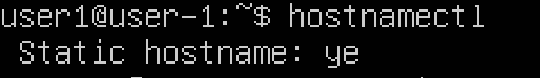
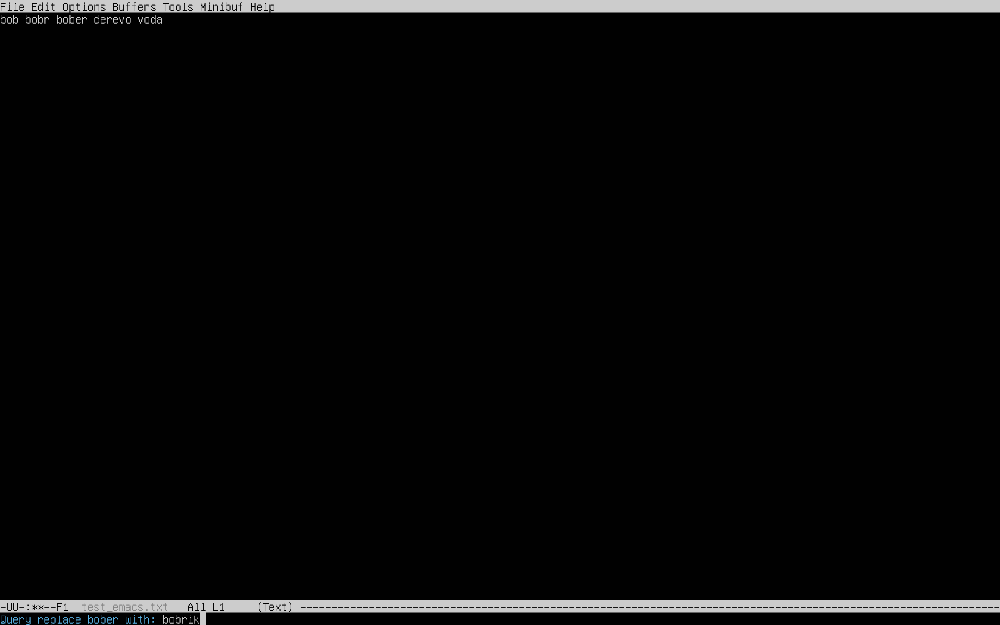
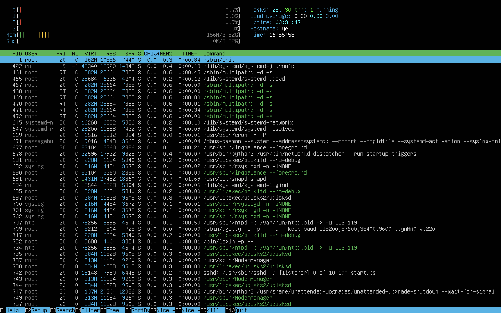

## Part 1. Установка ОС ##
Установил Ubuntu 20.04 Server LTS без графического интерфейса.

*рис. 1 : установка ОС*

## Part 2. Создание пользователя ##
Создал пользователя user1, после чего добавил его в группу adm

*рис. 2 : добавил нового пользователя*

*рис. 3 : добавил нового пользователя в группу adm*

*рис. 4 : проверил добавление пользователя командой*

## Part 3. Настройка сети ОС ##
Задал имя машины user-1.

*рис. 5 : задал имя машины*

Установил временную зону.

*рис. 6 : установка временной зоны Moscow*

Вывел список сетевых интерфейсов.

*рис. 7 : сетевые интерфейсы*

Интерфейс lo является локальной петлёй, имеющей IP-адрес 127.0.0.1. Она предназначена для обеспечения сетевого доступа к компьютеру.

Получаю ip адрес от DHCP с помощью команды "hostname -I"

*рис. 8 : вывод ip адреса*

DHCP (Dynamic Host Configuration Protocol) — протокол динамической настройки узла, позволяющий устройствам автоматически получать IP-адрес, данные о DNS-сервере и другие параметры, необходимые для работы в сети.

Определил и вывел внешний и внутренний ip адреса шлюзов.

*рис. 9 : вывод ip адресов шлюзов*

Задал статичные настройки ip, gw, dns, используя публичный DNS сервер: 8.8.8.8

*рис. 10 : заданные статичные настройки*

пропинговал 1.1.1.1 и ya.ru

*рис. 11 : вывод результата 0% packet loss*

## Part 4. Обновление ОС ##
Обновил системные пакеты до последней версии

*рис. 12 : обновления отсутствуют*

## Part 5. Использование команды sudo ##
Разрешил пользователю, созданному в Part 2, выполнять команду sudo.

*рис. 13 : изменил hostname на ye*

Sudo – это утилита для операционных систем семейства Linux, позволяющая пользователю запускать программы с привилегиями другой учётной записи, как правило, суперпользователя.

## Part 6. Установка и настройка службы времени ##
Синхронизировал время с помощью службы ntp

*рис. 14 : NTPSynchronized=yes*

*рис. 15 : правильные дата и время*

## Part 7. Установка и использование текстовых редакторов ##
Установил редакторы nano, vim, emacs, создал файлы test_nano.txt, test_vim.txt, test_emacs.txt и записал в них свой никнейм

Чтобы сохранить изменения, нажал ctrl+X, после чего вписал Y и нажал enter

*рис. 16 : nano*

Вышел из редактирования с помощью Esc, ввел :wq для выхода с сохранением изменений

*рис. 17 : vim*

Чтобы сохранить изменения, зашел в меню команд с помощью кнопки Esc, нажал ctrl+X и, не отпуская ctrl, нажал ctrl+S, потом аналогично, но вместо ctrl+C нажал ctrl+C

*рис. 18 : emacs*

Чтобы выйти без сохранения изменений, нажал ctrl+X, после чего вписал N и нажал enter

*рис. 19 : nano*

Вышел из редактирования с помощью Esc, ввел :q! для выхода без сохранения изменений

*рис. 20 : vim*

Чтобы выйти без сохранения изменени1, зашел в меню команд с помощью кнопки Esc, нажал ctrl+x ctrl+c, ввел no, после чего ввел yes

*рис. 21 : emacs*

Нахожу и меняю слово с помощью vim

*рис. 22 : vim*

Нахожу слово с помощью nano

*рис. 23 : nano*

Меняю слово с помощью nano

*рис. 24 : nano*

Нахожу слово с помощью emacs

*рис. 25 : emacs*

Меняю слово с помощью emacs

*рис. 26 : emacs*

## Part 8. Установка и базовая настройка сервиса SSHD ##
Для установки SSHd выполнил команду sudo apt-get install openssh-server, чтобы установить пакет openSSH сервера. 

Настроил автостарт, зайдя в файл sshd.service с помощью nano и добавив в параметр ExecStart флаг -D, после чего сохранил изменения и вышел из редактирования файла. После этого выполнил две команды: sudo systemctl daemon-reload - обновил конфигурацию systemd, sudo systemctl enable ssh - включил автозапуск службы SSHd с системой.

Чтобы изменить порт на 2022, зашел с nano в /etc/ssh/sshd_config и изменил Port на 2022, раскомментировав при этом строку с портом, перезапустил службу ssh, подключился к порту, использовав username@user-ip -p 2022

Прописал ps -C sshd, чтобы посмотреть, чтобы посмотреть наличие процесса sshd. 

Команда ps в UNIX-подобных операционных системах (таких как Linux) используется для отображения текущих процессов. Она позволяет пользователю просматривать список запущенных процессов, их идентификаторы (PID), родительские процессы (PPID), использование ресурсов и другую информацию о процессах.
Ключ -C в команде ps позволяет указать команду (или имя исполняемого файла), чтобы отобразить только те процессы, которые были запущены этой командой.

Вывод команды netstat -tan.

*рис. 27 : Port 2022*

-tan - это флаги команды netstat, означающие 
-t: Отображает только TCP-соединения.
-a: Показывает все (активные и слушающие) соединения.
-n: Выводит числовые IP-адреса и порты вместо их имен.

Каждый столбец в выводе netstat -tan означает следующее:

Proto: Используемый протокол (всегда tcp).
Recv-Q: Количество байт данных в очереди на прием.
Send-Q: Количество байт данных в очереди на отправку.
Local Address: IP-адрес и порт вашего компьютера.
Foreign Address: IP-адрес и порт удаленного компьютера.
State: Состояние TCP-соединения.

## Part 9. Установка и использование утилит top, htop ##
Установил htop и top.
Запустил top:
uptime: top - 16:28:59 up 5 min
количество пользователей: 1
общая загрузка системы: 0.00, 0.00, 0.00
общее количество процессов: 1 running 115 sleeping
загрузка cpu: 0.1us, 0.2sy, 0.0ni, 99.8id, 0.0wa, 0.0hi, 0.0si, 0.0st
загрузка памяти: 3908 total, 3432 free, 151 used
pid процесса, занимающего больше всего памяти: 1
pid процесса, занимающего больше всего процессорного времени: 1116

Вывод htop:

*рис. 28 : htop*

Сортированный вывод htop:

*рис. 29 : по PID*

Сортированный вывод htop:

*рис. 30 : по PERCENT_CPU*

Сортированный вывод htop:

*рис. 31 : по PERCENT_MEM*

Сортированный вывод htop:

*рис. 32 : по TIME*

Отфильтрованный вывод htop по sshd:

*рис. 33 : по sshd*

Поиск syslog по htop:

*рис. 34 : syslog*

Добавленный вывод hostname, uptime, clock в htop:

*рис. 35 : hostname uptime clock*

## Part 10. Использование утилиты fdisk ##
Использовав утилиту fdisk с влагом -l, получил следующие данные:
Название жесткого диска: /dev/vda
Размер жесткого диска: 64 gb
Количество секторов: 134217728
Размер swap: 3.8 gb

## Part 11. Использование утилиты df ##
Использовав утилиту df, получил следующие данные для корневого раздела:
размер раздела: 31270768 KBs
размер занятого пространства: 8166768 KBs
размер свободного пространства: 21489972 KBs
процент использования: 28%

Использовав утилиту df с флагами -Th, получил следующие данные для корневого раздела:
размер раздела: 30G
размер занятого пространства: 7.8G
размер свободного пространства: 21G
процент использования: 28%
тип файловой системы: ext4

## Part 12. Использование утилиты du ##
С помощью du вывел размеры:

/home

*рис. 36 : /home*

/var

*рис. 37 : /var*

/var/log

*рис. 38 : /var/log*

Также выывел размеры всего содержимого папки /var/log:

/var/log/*

*рис. 39 : /var/log/*

## Part 13. Установка и использование утилиты ncdu ##
Установил ncdu

Вывел для папок /home, /var, /var/log их размеры:

/home

*рис. 40 : /home*

/var

*рис. 41 : /var*

/var/log

*рис. 42 : /var/log*

## Part 14. Работа с системными журналами ##
Последняя авторизация в системе: 
время: Feb 15 17:36:40
имя пользователя: artem
метод входа: pam_unix

Рестартнул sshd с помощью sudo service ssh restart:

*рис. 43 : запись в логах о рестарте*

## Part 15. Использование планировщика заданий CRON ##
Используя планировщик задач запустил команду uptime каждые 2 минуты

*рис. 44 : задачи CRON*

*рис. 45 : запись в syslog о выполнении uptime*
